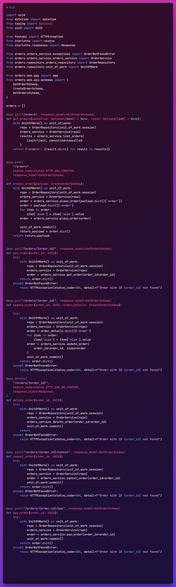

Microservice order

In this repo contains the microservice Order, wwhere service interact each other, we have a place order service, pay order service, schedule kitchen, cancel order and other functionality.

This service follow the different patterns and architecture, like Hexagonal architecture, unit of work pattern, To interface with the database, you can use an ORM library such as SQLAlchemy.

 <b> API -> UnitOfWork </b>
  

     

